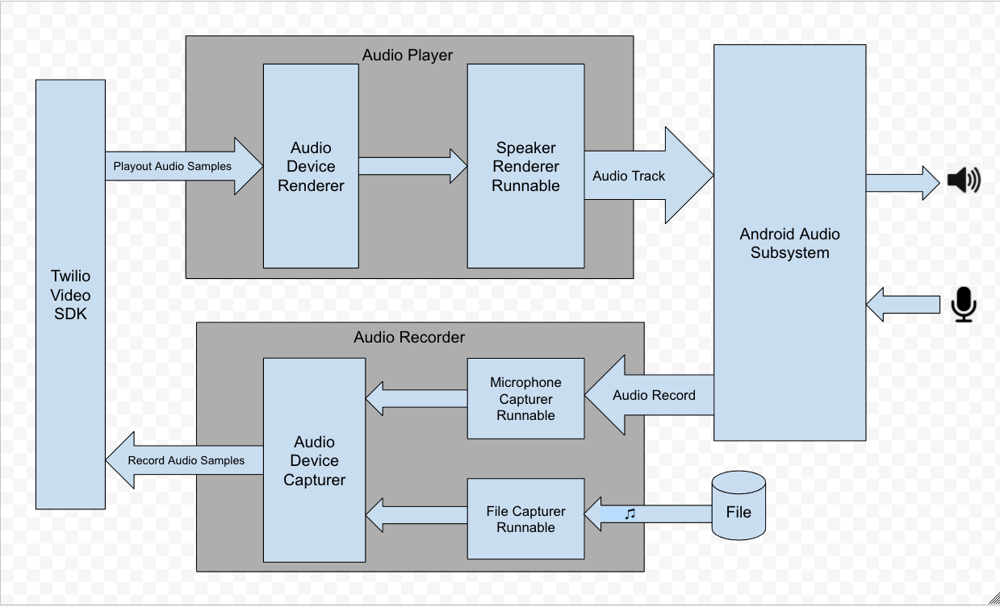

# Twilio Video AudioDevice Example

The project demonstrates how to use Twilio's Programmable Video SDK with audio playback and recording functionality provided by a custom `AudioDevice`.

The example demonstrates the custom audio device **exampleCustomAudioDevice**, which uses android audio subsystem to playback and record audio at 44.1KHz with built-in echo and noise cancellation.

1. The upstream audio subsystem receives remote participant's playout audio samples from the code audio device module and plays them in the speaker.
2. The downstream audio subsystem is capable to switch audio source between the local participant's microphone audio and audio from a file. The Video SDK receives and delivers the recorded audio samples to the core audio device module.

This diagram describes how **exampleCustomAudioDevice** uses `AudioDevice` to receive and deliver audio samples from/to the core audio device.

### Setup

See the master [README](https://github.com/twilio/video-quickstart-android/blob/master/README.md) for instructions on how to generate access tokens and connect to a Room.

This example requires Android Studio as well as two devices running Android API level 16 or higher.

### Running

Once you have setup your access token, install and run the example. You will be presented with the following screen:

<kbd></kbd>

Audio from a file is selected by default.

<kbd></kbd>

Once the remote participant is connected, music starts to play.

<kbd></kbd>

You can switch to microphone by clicking the pause button.

<kbd></kbd>

Note: The switch between audio file and microphone always starts the music from the beginning of the file.
